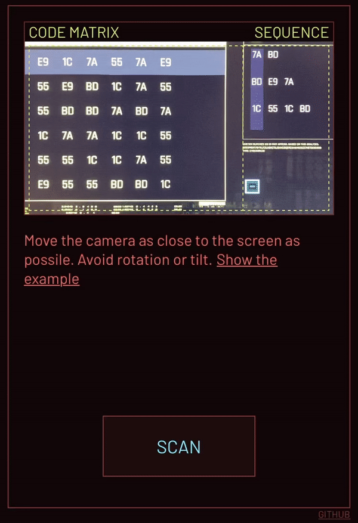
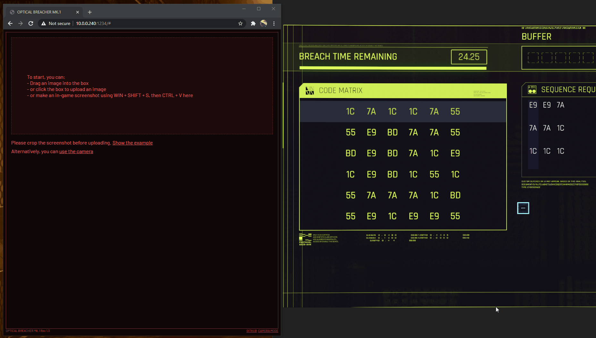

    

<h2 align="center">OPTICAL BREACHER</h2>
<h4 align="center">An online Cyberpunk 2077 breach protocol minigame solver using camera + OCR</h4>

Try it here: https://govizlora.github.io/optical-breacher

<!-- ALL-CONTRIBUTORS-BADGE:START - Do not remove or modify this section -->

<!-- ALL-CONTRIBUTORS-BADGE:END -->

## Details

The puzzle solving algorithm is simply brute force. (Better ideas welcomed!)

The target sequences are weighted from top to bottom as this: `1`, `1.1`, `1.2`, ... So it will focus on more hit first, and when even, the lower sequences will have higher priority.

The OCR part took the most time. I initailly used the default English OCR provided by tesseract, but it fails randomly (like recognizing "55" into "5") and the success rate is below 50%. Eventually I trained the model by myself, using tesstrain. Instead of recognizing single English characters, I let the program treat the byte as a whole, so the computer actually think "55" or "1C" as a single character in a mysterious language. The self-trained model worked better, but still not perfect. TBH I think maybe tesseract is not the best option, but since it's the only popular choice in JavaScript and I'm not famailiar with WASM, this will be the way to go for now.

## Local develop

### Using Node.js

1. Make sure you have `node` and `yarn` installed
2. Clone this repo, and run `yarn` to install the dependencies
3. Run `yarn start`. A browser window will open automatically with the app running. You can also accees the app using your phone, as long as they are under the same network.

### Using Docker

You can also run the app locally with docker using this [Dockerfile](https://gist.github.com/ddimick/d0e82da4805775bb12f2995b20fa223a) (thanks [@ddimick](https://github.com/ddimick)). In this case, you don't need to install `node` or clone this repo.

## Demo

### Camera mode

### Screenshot mode

## Acknowledgement

- https://github.com/kyle-rader/breach for test data
- https://github.com/naptha/tesseract.js which made this web app possible
- https://github.com/tesseract-ocr/tesseract and https://github.com/tesseract-ocr/tesstrain tesstrain made training the model a lot easier
- My wife for providing machine learning advices

## Contributors ✨

Thanks goes to these wonderful people ([emoji key](https://allcontributors.org/docs/en/emoji-key)):

<!-- ALL-CONTRIBUTORS-LIST:START - Do not remove or modify this section -->
<!-- prettier-ignore-start -->
<!-- markdownlint-disable -->
<table>
  <tr>
    <td align="center"><a href="http://www.rozmy.com"> <b>Peter Polgar</b></a> <a href="#design-rozmy" title="Design">🎨</a></td>
    <td align="center"><a href="https://steve-luo.com"> <b>Steve-luo</b></a> <a href="#design-Steve-luo" title="Design">🎨</a></td>
    <td align="center"><a href="https://github.com/ddimick"> <b>Doug Dimick</b></a> <a href="#infra-ddimick" title="Infrastructure (Hosting, Build-Tools, etc)">🚇</a></td>
  </tr>
</table>

<!-- markdownlint-restore -->
<!-- prettier-ignore-end -->

<!-- ALL-CONTRIBUTORS-LIST:END -->

This project follows the [all-contributors](https://github.com/all-contributors/all-contributors) specification. Contributions of any kind welcome!
